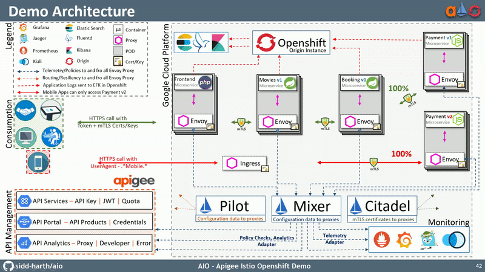

# Work In Progress - it will not digest if consumed :E
# AIO - Apigee Istio Openshift Demo

change VERSION2 in ayment v2 and also see count number in new lineee

Fault Injection

oc get pods -l app=payment -n apigee

while true; do curl http://movies-apigee.2886795268-80-kitek03.environments.katacoda.com; sleep .5; done

oc apply -f destination-rule-payment.yml -n apigee
oc apply -f virtual-service-payment-503.yml -n apigee
 
oc get destinationrule -n apigee
oc get virtualservice -n apigee
oc delete destinationrule payment -n apigee
oc delete virtualservice payment -n apigee

Delay

oc apply -f destination-rule-payment.yml -n apigee
oc apply -f virtual-service-payment-delay.yml -n apigee

Retry

We will make pod recommendation-v2 fail 100% of the time. Get one of the pod names from your system and replace on the following command accordingly:

oc exec -it $(oc get pods|grep payment-v2|awk '{ print $1 }'|head -1) -c payment /bin/bash

You will be inside the application container of your pod recommendation-v2-2036617847-spdrb. Now execute the following command inside the recommenation-v2 pod:

$ oc exec -it $(oc get pods|grep payment-v2|awk '{ print $1 }'|head -1) -c payment /bin/bash
root@payment-v2-6f9554dfcf-mkw67:/app# curl localhost:8080/misbehave
payment-service-v2 - pod-ip -  Following requests to '/' will return a 503

root@payment-v2-6f9554dfcf-mkw67:/app# exit
exit

oc apply -f virtual-service-payment-v2_retry.yml

NOTE: You will see it work every time because Istio will retry the recommendation service and it will land on v1 only.

oc delete virtualservice payment

Timeout
use 7 sec delay and then use timout virtual service to return 504 upstream request timeout after 1 sec

Simple Routing

movies v1 v2 multiple versions 
	see round robin
	Canary deployment: Split traffic between v1 and v2
		v1 90 v2 10
		v1 10 v2 90
	all to v2

Smart routing based on user-agent header (Canary Deployment)
	payment v1 v2
		curl -A Firefox http://customer-t03.environments.katacoda.com
		curl -A Chrome http://custom0-80-kitek03.environments.katacoda.com

Mirroring Traffic (Dark Launch)
	oc get pods -l app=recommendation -n tutorial
You should have 2 pods for recommendation based on the command bellow:

	oc logs -f $(oc get pods|grep payment-v2|awk '{ print $1 }') -c payment
	Hit CTRL+C when you are satisfied.

Random Loadbalancing

oc scale --replicas=2 deployment/payment-v2
oc scale deployment recommendation-v2 --replicas=2 -n tutorial
oc scale deployment recommendation-v2 --replicas=3 -n tutorial
oc get pods -w
while true; do curl http://moviesssssssnvironments.katacoda.com; sleep .5; done

The results should follow a fairly normal round-robin distribution pattern where  v2 receives the request 3 times more than v1

Scale back to a single replica of the recommendation-v2 deployment:

oc scale --replicas=1 deployment/recommendation-v2

On Terminal 2, you will see requests being round-robin balanced between v1 and v2.

